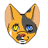
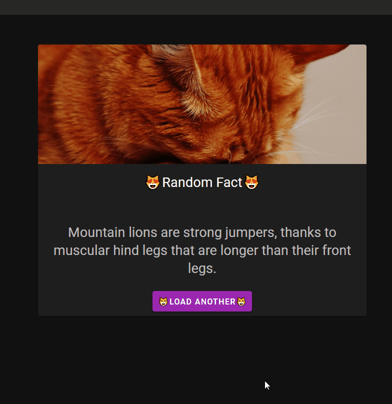

# Katz 😼

<div align="center">


<p>Is a simple SPA that give you , cat lovers , a random fact about our fluffy little friends .</p>
<p>This app uses the end point</p>

[CAT API](https://catfact.ninja/)

<p>to fetch the random facts.</p>

<p>This is made using :</p>
</div>

<div align="center">


<h6><strong>A</strong>xios</h6>
</div>

## How does it work :

<div align="center">

</div>

## Build Setup

```bash
# install dependencies
$ pnpm install

# serve with hot reload at localhost:3000
$ pnpm run dev

# build for production and launch server
$ pnpm run build
$ pnpm run start

# generate static project
$ pnpm run generate
```

## Support

```
Any help improving this spa , is welcomed ❤️
```

## Contact

```
you can contact me at ZTF666@protonmail.ch or via my portfolio
```

<div align="center">

<table>
  <tr>
    <td align="center"><a href="https://ztfportfolio.web.app/" target='_blank'><br /><sub><b>ZTF666</b></sub></a></td>
  </tr>
</table>

</div>

## License

**Katz 😼** released under the [MIT](LICENSE) License.

## Legal & Credits

> The pixel logo is made by my little sister ! Any redistribution without consent is prohibited. Don't steal a 16y/o work lol.

<br>

> The cats pictures are from : [PEXELS](https://www.pexels.com/search/cats/)

```
Made with 💘 by a 👨‍💻 on a 💻 | 2020 | ZTF666
```
